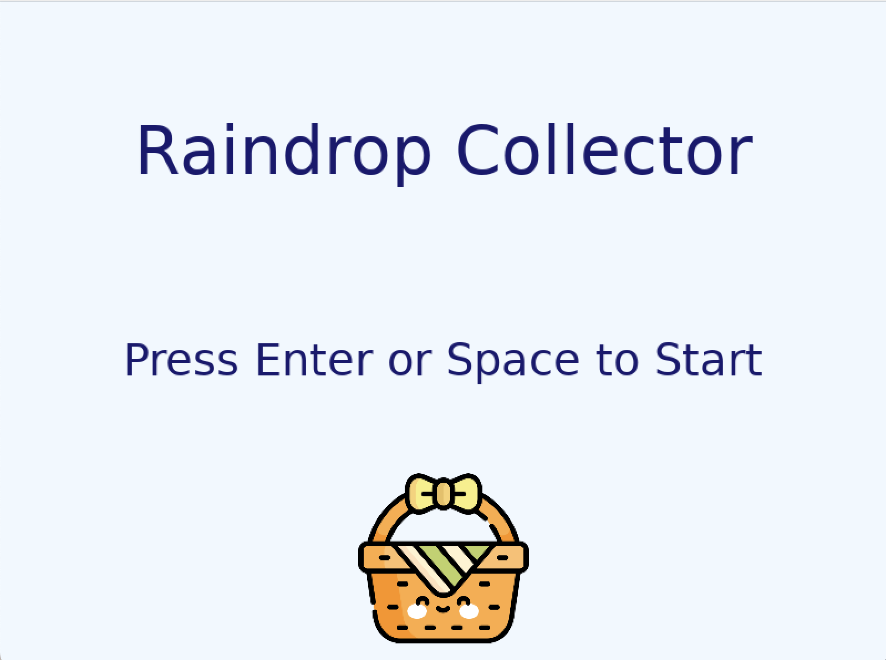
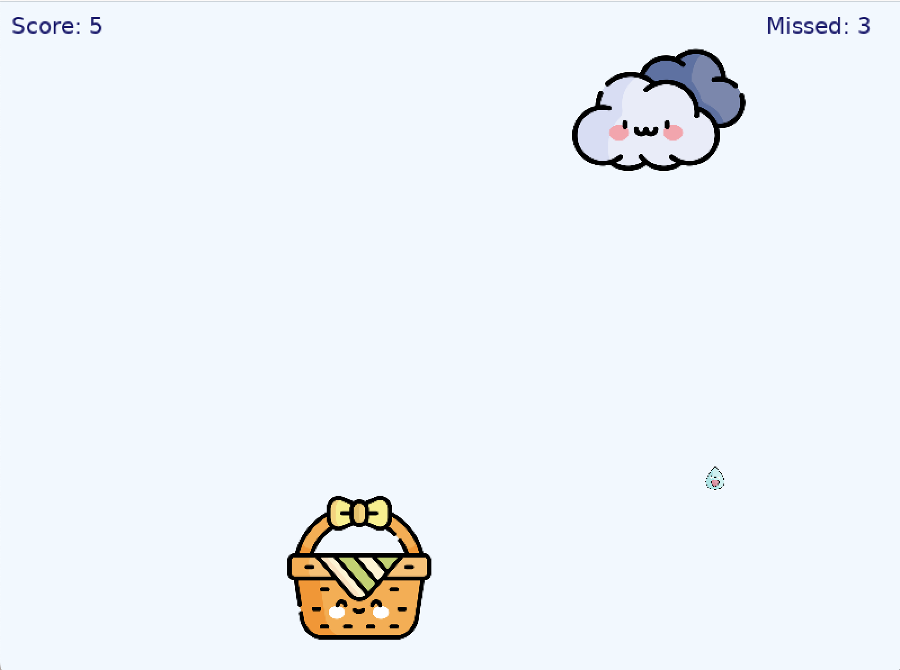
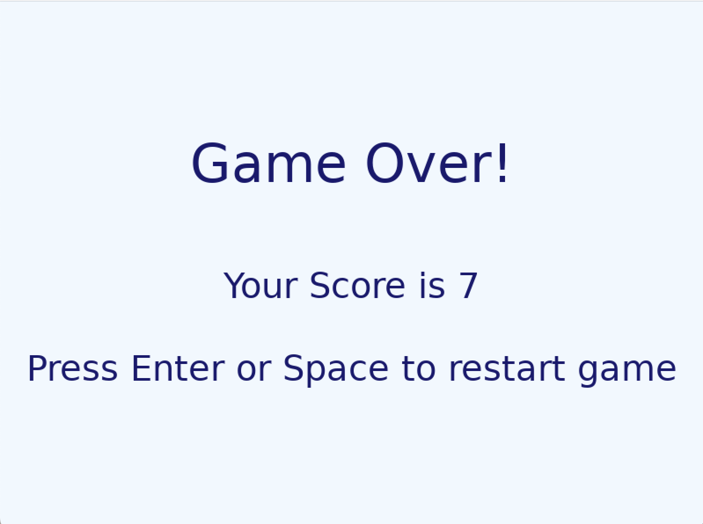

# Raindrop Collector

Raindrop collector is a game written in Lua using the Love2D framework.

## Table of Content

- [How to run the game](#how-to-run-the-game)
- [Usage](#usage)
- [Game Logic](#game-logic)
- [Source Files](#source-files)
- [Acknowledgement](#acknowledgements)

## How to run the game

1. Download LÖVE from [here](https://love2d.org/)
2. Two ways to run the game:

- Download or clone this repo and drag the folder to the LÖVE application shortcut
- Or download the **RaindropCollector.love** file from the latest release [here](https://github.com/flora8heart/raindrop-collector/releases/tag/v.1.0.0). Double click on the `.love` file to run it.

## Usage

1. On the intro screen, press `Return` or `Space` to start the game.
2. Use the `left`/`a` and `right`/`d` keys to collect the raindrops
3. After more than _5 raindrops_ is missed, the game ends.
4. Press `Return` or `Space` to restart the game; or `Q` or `esc` key to exit to intro screen.

## Demo

**Intro Screen**

 

**Playing Screen**

**Game Over Screen**

## Game logic

- The cloud movement speed increases every time after 10 raindrops has been collected.
- The basket movement speed increases accordingly as the game increases in difficulty as cloud movement speed increass.

<!-- ## Source Files -->

<!-- ## Future work -->

<!-- ## Acknowledgements -->
